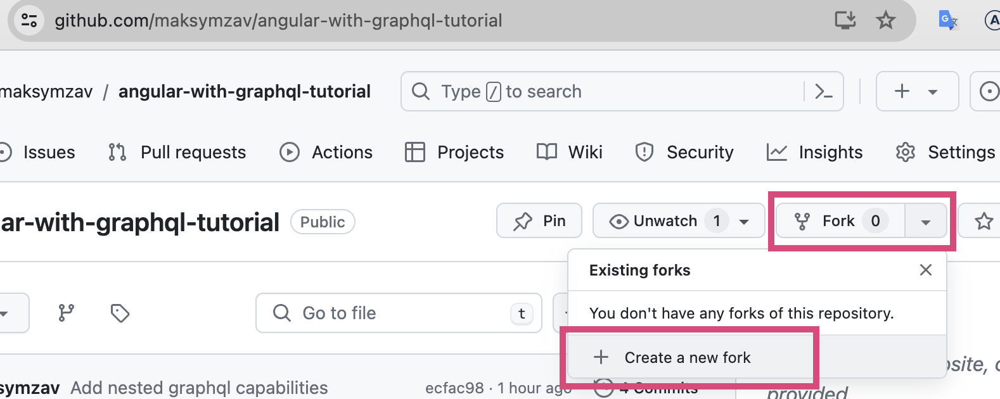
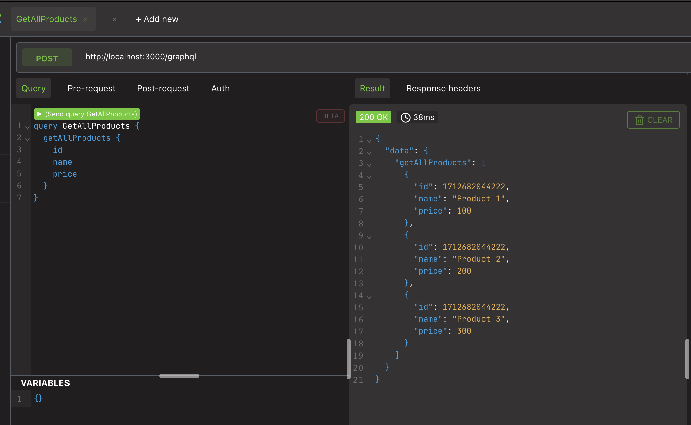
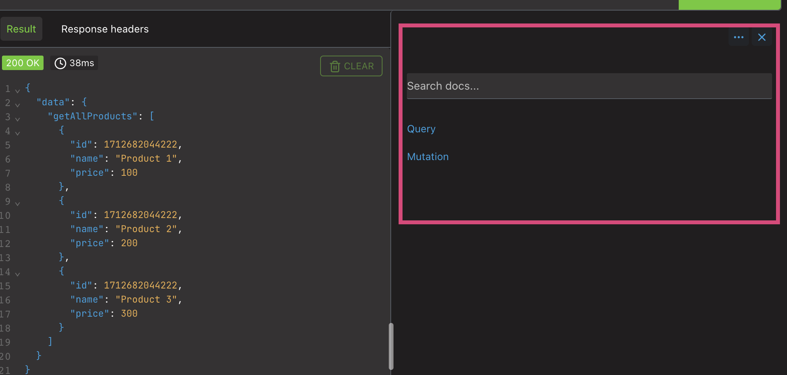
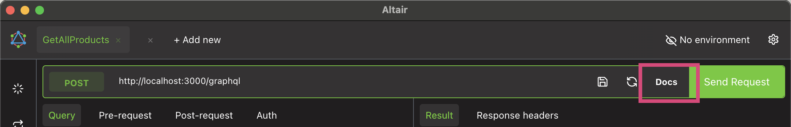

# Angular With GraphQL Tutorial

This tutorial is about how to use **Angular** with **GraphQL**.

You're probably wondering, "What is GraphQL and why is there a tutorial about it?"

Well, you need GraphQL to get some data from an API. But it's different from HTTP.

## What is GraphQL? Introduction for a Beginner

**GraphQL** is like a smart postman for your application. It's a query language for APIs and a runtime for executing those queries with your existing data.

Imagine you have a bunch of friends (data) living in different houses (databases). You want to ask them about their favorite color, but some friends also have pets and you want to know the pets' names too. Instead of going to each house individually and asking each friend separately about their color and their pet (like REST), you send GraphQL.

You tell GraphQL exactly what you want: "Get me the favorite color and pet names from these friends". GraphQL goes to all the houses (databases), gathers all the info, and returns it to you in a single trip, exactly how you asked for it.

This way, you get exactly what you need, nothing more or less, saving unnecessary data transfers. It's efficient and flexible, perfect for complex systems with lots of data stored in different places.

## Let's try it out

#### Step 1: Install a GraphQL client for your computer

I suggest installing the Altair GraphQL client. https://altairgraphql.dev/
Install it on your computer and open it.

#### Step 2: Fork this repository

This creates your own copy of the repository.

#### Step 3: Clone the repository

Open your terminal and run the following command, replacing `{your_github_name}` with your GitHub username:

```bash
git clone https://github.com/{your_github_name}/angular-with-graphql-tutorial.git
```

#### Step 4: Install the dependencies

```bash
cd angular-with-graphql-tutorial
npm install
```

#### Step 5: Start the GraphQL server
In the same terminal, run the following command:
```bash
nx serve api
```

#### Step 6: Play with GraphQL

Open Altair GraphQL client and set the URL to `http://localhost:3000/graphql`. You can now play with the GraphQL queries.
Start from inserting the following query:

```graphql
query GetAllProducts {
  getAllProducts {
    id
    name
    price
  }
}
```

The result should look like this:


Pay attention that graphql returns only the fields you asked for in a query.

Then inspect the right part of the window, it allows you to see the schema of the API.
That means you can see everything that the API can do.

If you don't see this section, click the "Docs" button in the top right corner.


**Queries** allow you to get data from the server.
**Mutations** allow you to change data on the server.

Click on Queries. Here you can see all the queries you can run.

Then try to update the query in the left part of the window to add more information:

```graphql
query GetAllProducts {
  getAllProducts {
    id
    name
    price
    stores {
      id
      name
    }
    seller {
      id
      name
    }
  }
}
```

The result should look like this:
```json
{
  "data": {
    "getAllProducts": [
      {
        "id": 1712682044222,
        "name": "Product 1",
        "price": 100,
        "stores": [
          {
            "id": 1,
            "name": "Store 1"
          },
          {
            "id": 2,
            "name": "Store 2"
          }
        ],
        "seller": {
          "id": 1,
          "name": "Seller 1"
        }
      },
...
```
So when you ask more information, you get more information.
Play with the queries from the right part of the window to see what you can get.
